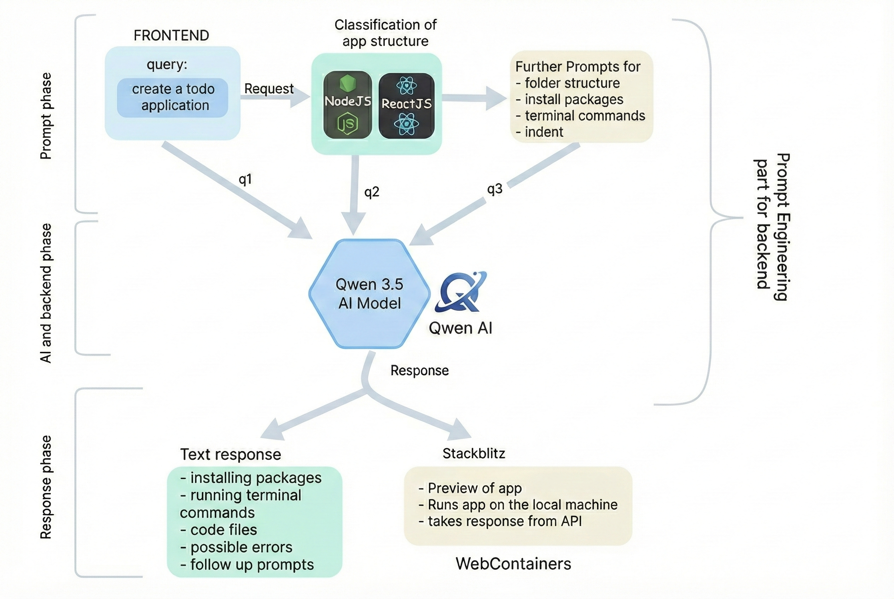

# Bilt AI

## About the Project

**Bilt AI** is an AI-driven platform that transforms natural language prompts into fully functional **React + Node.js applications**.

It analyzes user intent, identifies frontend and backend requirements, and generates production-ready project structures, configurations, and code. Developers can refine the output using follow-up prompts, making the system iterative, flexible, and developer-friendly.

The platform runs applications directly in the browser using **StackBlitz WebContainers**, eliminating local setup while still supporting real package installation and command execution.

---

## System Architecture

The diagram below illustrates the end-to-end flow of prompts, AI processing, and application execution.

---

## Key Features

- Natural language to full-stack application generation
- Automatic React + Node.js project scaffolding
- TypeScript-first code generation
- Real-time package installation and command execution
- In-browser app runtime using WebContainers
- Iterative refinement via follow-up prompts
- Clear visibility into generated files and errors

---

## Tech Stack

- **Frontend:** React.js, TypeScript  
- **Backend:** Node.js  
- **AI Model:** Qwen 3.5  
- **Runtime:** StackBlitz WebContainers  
- **Tooling:** Vite, Tailwind CSS, ESLint  

---

## Screenshots

### 1. Prompt Input & Intent Understanding
Users describe their application in natural language.  
The prompt is parsed and classified to determine framework, architecture, and required dependencies.

---

### 2. Project Scaffolding & File Generation
Based on the classified intent, Bilt AI generates:
- Folder structure
- Configuration files
- Dependency setup
- Initial boilerplate code

---

### 3. Code Generation & Type Safety
The platform produces structured, readable **TypeScript-based React code**, following best practices and ready for modification through follow-up prompts.

---

### 4. In-Browser Execution & Live Preview
The generated application runs instantly using **StackBlitz WebContainers**, supporting real npm installs, command execution, and API responses without local setup.

